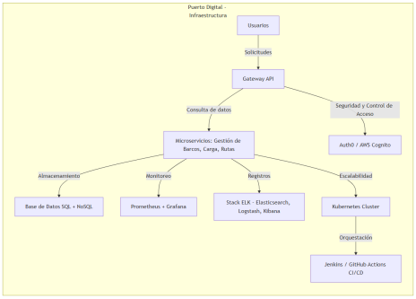

# PortTrack

La empresa PortTrack ha sido contratada para desarrollar una plataforma de navegación portuaria que permita monitorear, coordinar y
gestionar el flujo de embarcaciones en un puerto comercial. La plataforma debe permitir a las autoridades portuarias:
- Gestionar el inventario de barcos en el puerto.
- Administrar la carga y descarga de mercancías.
- Coordinar el personal portuario involucrado en cada operación.
- Supervisar las rutas de entrada y salida de los barcos.
- Realizar el seguimiento marítimo en tiempo real para mejorar la eficiencia y seguridad del tráfico portuario.

Actualmente, la plataforma carece de estrategias de despliegue y monitoreo continuo, lo que dificulta su estabilidad y escalabilidad. Los
estudiantes deberán diseñar una estrategia de despliegue y monitoreo continuo para esta plataforma, asegurando automatización,
escalabilidad y resiliencia.

# Arquitectura y Retos del Proyecto
La infraestructura portuaria y su sistema de gestión presentan múltiples desafíos, por lo que es crucial implementar soluciones basadas en
DevOps y cloud computing.
1. Escalabilidad y disponibilidad:
El puerto maneja gran cantidad de datos en tiempo real (barcos, rutas, mercancías, clima, seguridad).
Se necesita una arquitectura escalable que permita un crecimiento continuo sin afectar el rendimiento.
2. Despliegue y actualización de la plataforma:
El sistema requiere despliegues frecuentes sin afectar las operaciones en curso.
Se necesita una estrategia de rollback en caso de fallos para evitar pérdidas de datos o problemas de seguridad.
3. Monitoreo en tiempo real y observabilidad:
Es necesario un monitoreo proactivo de la infraestructura para detectar fallos en la conectividad, anomalías en el tráfico marítimo o
problemas en los servidores.
Se deben centralizar los logs y métricas para detectar patrones de comportamiento anómalo.
4. Seguridad en el entorno de despliegue:
La plataforma manejará información confidencial de embarcaciones y operaciones portuarias.
Es esencial implementar gestión de credenciales y seguridad en la comunicación entre servicios.

# Diagrama de la Infraestructura Propuesta
A continuación, se muestra un esquema de la infraestructura para la plataforma de navegación portuaria, incluyendo despliegue, monitoreo y seguridad.

